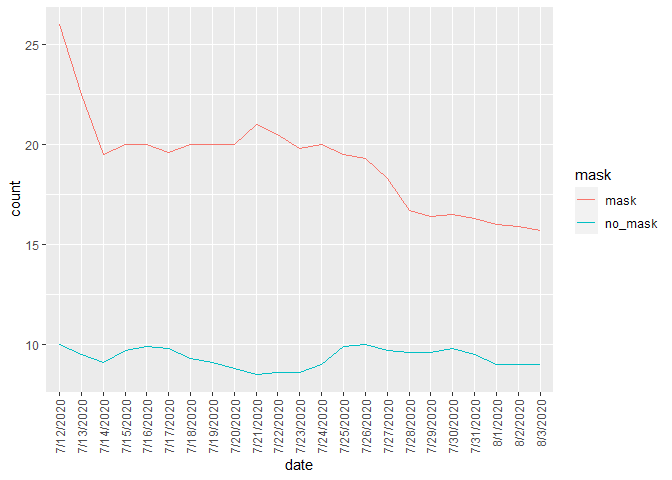

Lab 07 - Conveying the right message through visualisation
================
Qilin Zhang
2/7/2023

### Load packages and data

``` r
library(tidyverse) 
```

### Exercise 1

``` r
df <- tribble(
  ~date, ~count, ~mask,
  "7/12/2020", 26, "mask",
  "7/13/2020", 22.5, "mask",
  "7/14/2020", 19.5, "mask",
  "7/15/2020", 20, "mask",
  "7/16/2020", 20, "mask",
  "7/17/2020", 19.6, "mask",
  "7/18/2020", 20, "mask",
  "7/19/2020", 20, "mask",
  "7/20/2020", 20, "mask",
  "7/21/2020", 21, "mask",
  "7/22/2020", 20.5, "mask",
  "7/23/2020", 19.8, "mask",
  "7/24/2020", 20, "mask",
  "7/25/2020", 19.5, "mask",
  "7/26/2020", 19.3, "mask",
  "7/27/2020", 18.3, "mask",
  "7/28/2020", 16.7, "mask",
  "7/29/2020", 16.4, "mask",
  "7/30/2020", 16.5, "mask",
  "7/31/2020", 16.3, "mask",
  "8/1/2020", 16, "mask",
  "8/2/2020", 15.9, "mask",
  "8/3/2020", 15.7, "mask",
  "7/12/2020", 10, "no_mask",
  "7/13/2020", 9.5, "no_mask",
  "7/14/2020", 9.1, "no_mask",
  "7/15/2020", 9.7, "no_mask",
  "7/16/2020", 9.9, "no_mask",
  "7/17/2020", 9.8, "no_mask",
  "7/18/2020", 9.3, "no_mask",
  "7/19/2020", 9.1, "no_mask",
  "7/20/2020", 8.8, "no_mask",
  "7/21/2020", 8.5, "no_mask",
  "7/22/2020", 8.6, "no_mask",
  "7/23/2020", 8.6, "no_mask",
  "7/24/2020", 9, "no_mask",
  "7/25/2020", 9.9, "no_mask",
  "7/26/2020", 10, "no_mask",
  "7/27/2020", 9.7, "no_mask",
  "7/28/2020", 9.6, "no_mask",
  "7/29/2020", 9.6, "no_mask",
  "7/30/2020", 9.8, "no_mask",
  "7/31/2020", 9.5, "no_mask",
  "8/1/2020", 9, "no_mask",
  "8/2/2020", 9, "no_mask",
  "8/3/2020", 9, "no_mask",
)
```

### Exercise 2

``` r
df %>%
  ggplot(aes(x=date,y=count,color = mask, group = mask))+
  geom_line()+
  theme(axis.text.x = element_text(angle = 90, vjust = 0.5, hjust=1))
```

<!-- -->

### Exercise 3

It shows the mean difference between mask and no-mask better. In the
original graph, the scale for two levels are combined together, making
it harder to see their differences.

### Exercise 4

It seems like masking relate to more daily case count. I think it could
be the reason of people only opt to mask after getting sick (likely
covid).
